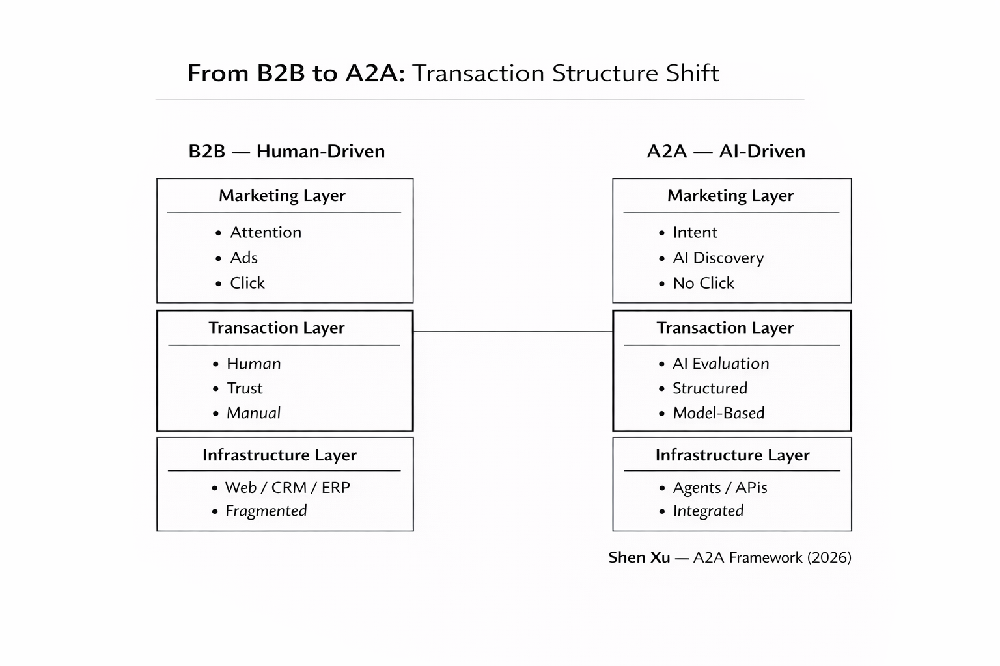

# A2A (AI-to-AI): Decision Layer Exploration

A2A (AI-to-AI) represents a shift in transaction structure, where AI systems participate in discovery, evaluation, and decision-making processes.



## Core Idea

Instead of human-driven exploration and comparison:

- AI handles evaluation
- Decisions are structured rather than discovered
- Interaction shifts from clicks to outcomes

## Minimal Execution

Set your own OPENAI_API_KEY before running the script.

```bash
python run_decision.py
